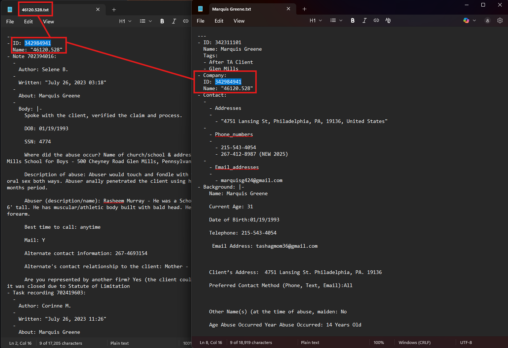

# Baldante Highrise

```sql
drop table Baldante_Highrise..phone
drop table Baldante_Highrise..address
drop table Baldante_Highrise..email_address
drop table Baldante_Highrise..emails
drop table Baldante_Highrise..email
drop table Baldante_Highrise..notes
drop table Baldante_Highrise..tasks
drop table Baldante_Highrise..contacts
drop table Baldante_Highrise..company
```

`Data Source=dylans\mssqlserver2022; Initial Catalog=Baldante_Consolidated; User Id =sa; Password=Int3gra!1; Connection Timeout=10000`

## Installation
1. Create python virtual enviroment
```bash
py -m venv .venv
```
2. Activate the virtual environment and install dependencies from `requirements.txt`
```bash
.\.venv\scripts\active
pip install -r requirements.txt
```

## Data Structure
Highrise data: `D:\Baldante\data\2025-08-21\contacts`

**Contacts** - Filenames contain actual names: `Mitchell Morris.txt`
- Name
- Tags
- Background
- Address
- Email Address
- Phone Numbers
- Notes
- Emails _(unconfirmed but 99%)_
- Tasks _(unconfirmed but 99%)_

**Company** - Filenames are numeric: `45985.578.txt`
- Name
- Tags
- Background
- Address
- Email Address
- Phone Numbers
- Notes
- Emails _(unconfirmed but 99%)_
- Tasks _(unconfirmed but 99%)_





`[company].[id] <--> [contact].[company].[id]`


**_email relationship_**


- [ ] Find existing Tabs3 cases and add notes, tasks, emails to them from the highrise data
- [ ] For the cases that don't exist, create them and add notes, tasks, emails to them


## Conversion Procedure

### Parse Highrise data
[1_discovery\main.py](D:\Baldante\highrise\1_discovery\main.py)
```py
py -m highrise.parse_data.main <server> <database> <input>
py -m highrise.parse_data.main -s dylans\mssqlserver2022 -d baldante_highrise -i D:\Baldante\data\2025-08-21\contacts
```

### Run migration scripts: 
`D:\Baldante\highrise\3_conversion`

```bash
sami run -f D:\Baldante\highrise\conversion -s dylans\mssqlserver2022 -d baldante_consolidated
```


**Contacts**
1. clear data
2. create functions and SPs
3. create `[implementation_users]`
4. insert Highrise contacts
5. insert contact information into Highrise contacts
6. insert contact information into Tabs3 contacts
7. recreate `[AllContactInfo]`
8. recreate `[IndvOrgContacts__Indexed]`

**Cases**
1. insert Cases from Highrise (case groups, case types, roles)
2. insert Notes, Tasks, Emails into Highrise cases
3. insert Notes, Tasks, Emails into Tabs3 cases


## Table Reference

```sql
select * from Baldante..contacts
select * from Baldante..address
select * from Baldante..phone
select * from Baldante..email
select * from Baldante..company
select * from Baldante..notes
select * from Baldante..tasks
```


company = case number
contacts w no company, create contact and either
a) enter notes into contact
b) create case, insert notes/emails/tasks


contacts with company_name, find the tabs case (company_Name = cassnum)
insert notes/tasks/emails

contacts without company_name, create cases
insert notes/tasks/emails


## Cases:
- [ ] for contacts with company_name, find the Tabs case
	- contacts.company_Name = tabs case number
	- [ ] insert notes
	- [ ] insert tasks
	- [ ] insert emails
- [ ] for contacts without company_name:
	- [ ] create a case
	- [ ] insert notes
	- [ ] insert tasks
	- [ ] insert emails

## Contacts:
Attempt to match on name. If contact exists -> update that record. If not -> create one
insert phone number
insert email address
insert address


1. contacts with no name match
	- create contact
	- insert addr
	- insert email
	- insert phone
2. contacts with name match
	- insert addr
	- insert email
	- insert phone
---
3. cases with no case number match
	- create case
	- insert tags
	- insert plaintiff
	- insert defendant
	- insert emails
	- insert notes
	- insert tasks
4. cases with case number match
	- insert tags
	- insert notes
	- insert tasks
	- insert emails


- [ ] update existing contacts (name match)
	- highrise contacts won't exist at this point, so no conflicts
	- 